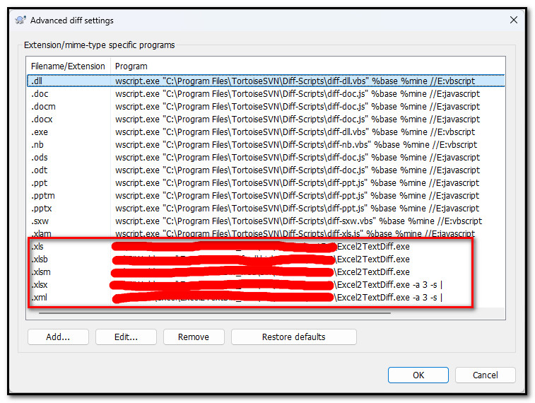
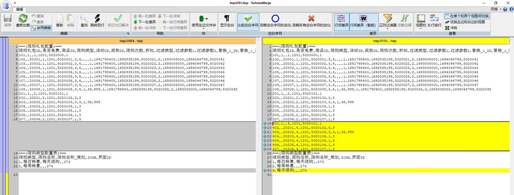
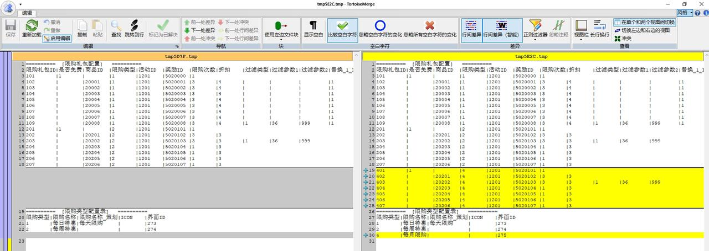

# Excel2TextDiff

一个方便diff excel族(xls,xlsx,csv,xml)文件的工具。将excel文件转为文本文件，然后再调用diff程序，极其方便直观地对比excel文件的变化。非常有用！

**===需要安装 [.net 5 sdk](https://dotnet.microsoft.com/en-us/download/dotnet/5.0)或[.net 6 sdk](https://dotnet.microsoft.com/en-us/download/dotnet/6.0)或更高版本===**

## 配置方式

    

## 对比效果
默认对比效果

使用参数 -a 1 -s | 效果

## 更新内容
更新1：增加对比效果参数支持

    -a 数字  从第几行开始对齐，默认为0(不对齐)
    -s 字符  一行数据中各单元格之间的分隔符，默认为","

更新2：支持xml格式的excel文件（XML Spreadsheet 2003）

## 支持与联系

QQ群: 692890842 （Luban开发交流群）
